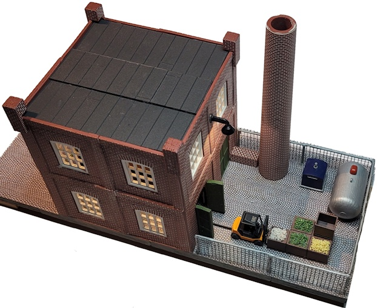

# Fabriekje met bewegende forkheftruck
Arduino Nano code om vorkheftruck heen en weer te laten rijden.
De vorheftruck brengt en haalt een pallet.

## Arduino IDE bouwen
Dit project is gemaakt voor Platform.io, maar is ook gewoon in de standaard Arduino IDE te bouwen. Dan moet de file "main.cpp" van naam gewijzigd worden in "main.ino". Deze "main.ino" naar een folder met de naam "main" kopieren en dan openen in de Arduino IDE is voldoende. Er worden geen speciale libraries gebruikt.

